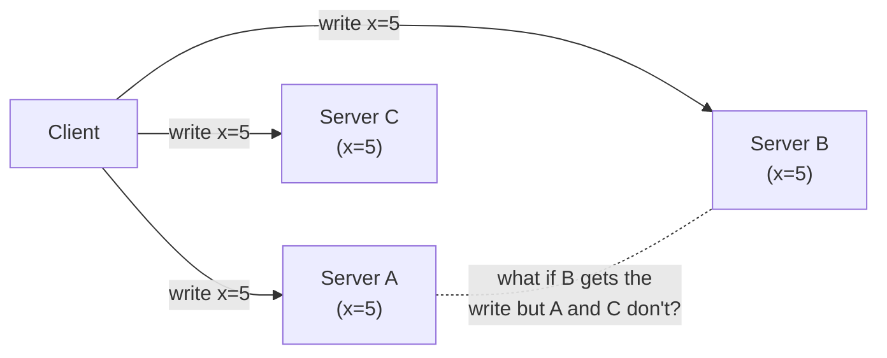
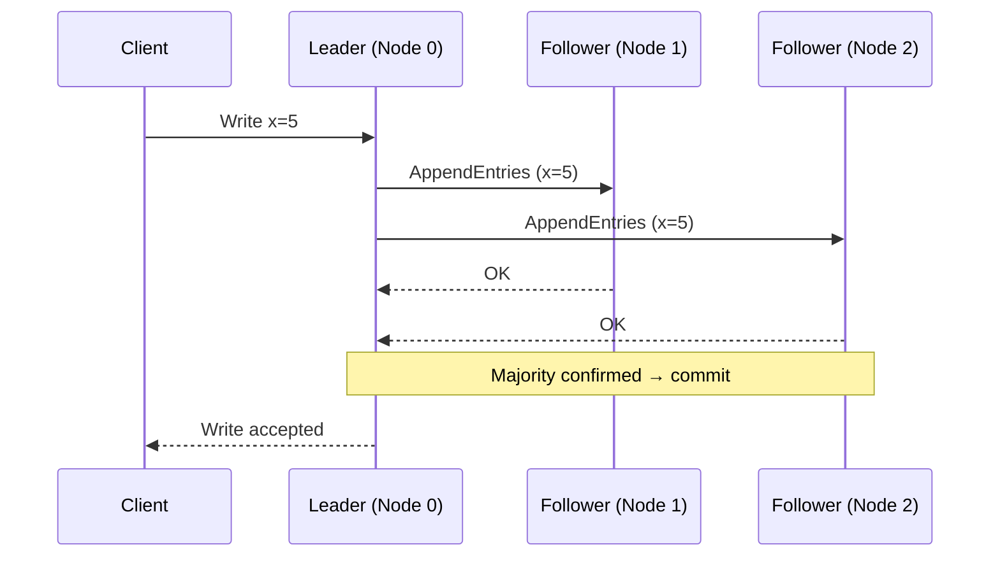
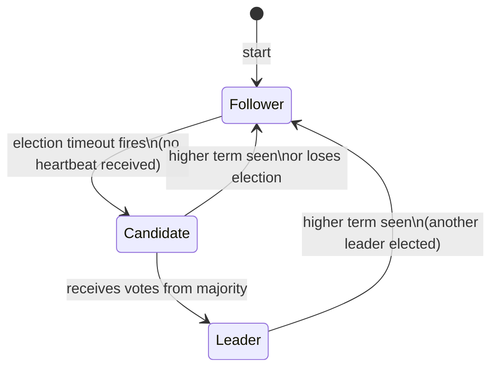
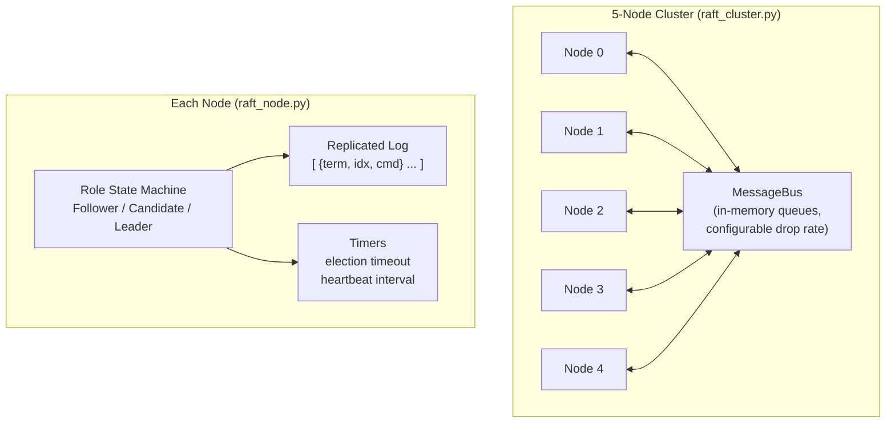

# Distributed Consensus: Raft in Practice

Hands-on Python implementations of the Raft consensus algorithm — starting from the core problem of keeping multiple servers in agreement, all the way to a working 5-node cluster that survives leader crashes and re-elects without losing a single committed entry.

---

## The Problem We Are Solving

Imagine you are building a database that must stay available even if a server dies. The obvious answer is to run copies on multiple servers. But now you have a new problem: **how do you keep all copies in sync?**



If a network hiccup means only Server B gets the write, you now have three servers that disagree on the value of `x`. Any server that answers a read might return a stale or wrong value. This is the **distributed consensus problem**: getting a group of servers to agree on a sequence of values, even when messages get lost, delayed, or servers crash.

Real systems that solve this problem are everywhere: **etcd** (stores Kubernetes cluster state), **CockroachDB** (distributed SQL), **Consul** (service discovery). They all use algorithms like Raft under the hood.

---

## Why Is This Hard?

Three properties you want from a distributed system are in tension:

| Property | What It Means | Trade-off |
|---|---|---|
| **Consistency** | All servers see the same data | May refuse requests during failures |
| **Availability** | Every request gets a response | May return stale data |
| **Partition Tolerance** | Works despite dropped messages | Can't have all three simultaneously |

This is the **CAP theorem**: you can pick at most two. Raft picks **Consistency + Partition Tolerance** — it will stall rather than return wrong data.

On top of that, the **FLP impossibility result** (1985) proved mathematically that no algorithm can guarantee both safety (never wrong) and liveness (always makes progress) in an asynchronous network where nodes can crash. Every real consensus algorithm accepts this trade-off by using timeouts to detect failures and make progress.

---

## What Raft Does

Raft solves consensus by electing one server as a **Leader** and routing all writes through it. The leader replicates every write to a majority of servers before confirming it. A majority is the key — if 3 out of 5 servers have a log entry, any future quorum of 3 will include at least one of them, so no committed entry is ever lost.



Every server can be in one of three roles at any time:

- **Follower** — passive; accepts log entries from the leader, votes in elections.
- **Candidate** — trying to become leader; requests votes from peers.
- **Leader** — handles all client writes; sends heartbeats to suppress new elections.



---

## What You Will Build

**Script 1 — `raft_node.py`**: A single Raft node state machine with no networking. You run it and watch it transition through all three roles, process vote requests, append log entries, and advance its commit index — all annotated with print output explaining *why* each step is happening.

**Script 2 — `raft_cluster.py`**: Five nodes connected by in-memory message queues (no real network needed). You watch a full election play out, three writes replicate to a majority, the leader crash-stop, a new election, and replication continuing — with split-brain confirmed absent at the end.

---

## Learning Objectives

By the end of this lab, you will be able to:

1. Explain why you cannot have both perfect safety and perfect liveness in a distributed system (FLP impossibility).
2. Describe what a quorum is and why a majority specifically is required.
3. Trace the three vote-granting rules Raft uses to ensure at most one leader per term.
4. Explain how log entries are replicated and what "committed" means in Raft.
5. Describe what happens during a network partition and why the minority side stalls instead of electing a new leader.

---

## Architecture Overview



Each `ClusterNode` thread runs a 10ms tick loop: process one inbound message from the bus, then check election and heartbeat timers. The protocol logic is entirely reactive — the same model production Raft implementations use with event loops.

---

## Lab Implementation & Engineering Deep Dives

### 1. Raft Node State Machine ([python/raft_node.py](./python/raft_node.py))
The core Raft state machine for a single node — no network required.
- **Why**: Understanding the node in isolation is the prerequisite for understanding the cluster. Every correctness property in Raft is enforced at the individual node level: a node decides whether to grant a vote, whether to accept a log entry, and when to step down — independently of what other nodes think.
- **What**: Implements `RaftNode` with all three roles (Follower, Candidate, Leader), the `VoteRequest`/`VoteResponse` RPC types, the `AppendEntries` RPC, and the commit index advancement logic. Running it standalone walks through every state transition with annotated output.
- **How**: Uses Python dataclasses for immutable RPC payloads and a monotonic clock for election timeouts. The `handle_vote_request` method encodes all three vote-granting rules (term check, one-vote-per-term, log freshness) in ~20 lines — making the safety argument directly visible in code.

### 2. 5-Node Cluster Simulation ([python/raft_cluster.py](./python/raft_cluster.py))
A full Raft cluster running in a single process via threads and in-memory queues.
- **Why**: The cluster simulation is where the emergent behaviour of the protocol becomes visible. Individual node correctness is necessary but not sufficient — you need to see leader election, concurrent replication, and failure recovery play out across multiple nodes to build intuition for *why* the protocol is safe under adversarial conditions.
- **What**: Spins up 5 `ClusterNode` threads sharing a `MessageBus`. The simulation drives through leader election, 3-entry log replication, a leader crash, re-election, and a final safety check confirming no split-brain.
- **How**: The `MessageBus` supports configurable drop rates for simulating partitions. Each `ClusterNode` thread runs a 10ms tick loop: process one inbound message, then check election/heartbeat timers. This mirrors how production Raft implementations use event loops — the protocol logic is entirely reactive.

---

## Setup & Running

```bash
cd distributed_consensus_learnings
python3 -m venv venv
source venv/bin/activate
pip install -r requirements.txt
```

### Run the single-node state machine demo
```bash
cd python
python raft_node.py
```

This is a good starting point. Read the output top to bottom — each line explains a decision the node is making.

### Run the full cluster simulation (5 nodes)
```bash
cd python
python raft_cluster.py
```

The simulation will:
1. Boot 5 nodes as followers.
2. Elect the first leader via randomised timeouts.
3. Replicate 3 log entries to a quorum.
4. Crash the leader.
5. Trigger re-election and confirm replication continues.
6. Assert no split-brain: no two nodes committed different entries at the same index.

---

## Key Concepts

### Quorum: why majority specifically?
With 5 nodes, any two groups of 3 must share at least one member. That shared member has seen both decisions, so a future leader always inherits the full committed history. A group of 2 cannot form a quorum, so a minority partition stalls instead of electing its own leader.

### Election safety: why can't two leaders exist at the same term?
Each node votes at most once per term. To win, a candidate needs votes from 3 out of 5 nodes. Since no node votes twice, two candidates cannot both reach 3 — one of them will fall short.

### Log freshness: why can't a stale node become leader?
A voter rejects a candidate whose log is behind its own. Since a committed entry was acknowledged by a majority, any quorum of voters includes at least one node that has that entry — and that node will refuse to vote for a candidate missing it.

For a deeper dive into the theory, see [docs/distributed_consensus_deep_dive.md](./docs/distributed_consensus_deep_dive.md).
