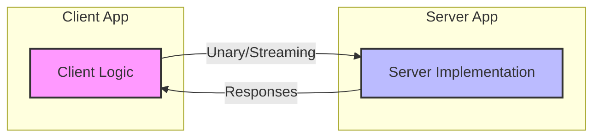

# gRPC: High-Performance RPC in Full-Stack Engineering

This lab provides a hands-on implementation of **gRPC** (Google Remote Procedure Call), the industry standard for high-performance microservice communication.

## Learning Objectives
By the end of this lab, you will understand:
1.  How to define a **Strict Service Contract** using Protocol Buffers.
2.  The mechanics of **HTTP/2 Transport** (Multiplexing, Binary Framing).
3.  How to implement all four communication patterns: **Unary, Server-Stream, Client-Stream, and Bi-Directional Stream**.

---

## Architecture Overview

The lab consists of a centralized Python server and a multi-purpose client. They communicate over a single HTTP/2 connection using binary-encoded messages.



---

## Lab Implementation & Engineering Deep Dives

### 1. Interface Definition ([messenger.proto](./messenger.proto))
The "Single Source of Truth" for your entire distributed system.
- **Why**: REST endpoints suffer from "Contract Drift" because the schema is often decoupled from the code. gRPC forces **Protocol-First Development**, where the binary contract is validated at compile-time. Binary field tags (e.g., `= 1`) are used instead of textual keys, eliminating the 30% "Information Tax" common in JSON parsing.
- **What**: This file defines the `service` (the API) and the `message` types (the payloads). 
- **How**: By using the Protocol Buffer DSL, we define Unary (Simple), Server-Stream (Push), Client-Stream (Upload), and Bi-Directional (Chat) patterns in a single, strictly-typed file.

### 2. Code Generation ([codegen.sh](./codegen.sh))
The bridge between your design and your execution.
- **Why**: Manual marshalling (converting objects to bits) is error-prone and slow. Automation ensures that the serialization logic is mathematically synchronized between client and server.
- **What**: Uses the `grpcio-tools` compiler to transform the `.proto` DSL into native Python classes. It generates `_pb2.py` (defining the "What" we send) and `_pb2_grpc.py` (defining the "How" we send it).
- **How**: Executing the `protoc` compiler generates IDE-ready stubs, providing full autocomplete and type-safety for remote network calls.

### 3. Server Logic ([server.py](./server.py))
The high-performance orchestrator of your service.
- **Why**: gRPC relies on persistent HTTP/2 streams. We use a `ThreadPoolExecutor` to ensure that long-running streaming calls do not block other incoming requests, allowing for thousands of concurrent multiplexed operations.
- **What**: Implements the `Servicer` base class, overriding the RPC handlers with actual business logic.
- **How**: For streaming patterns, the server uses standard Python **Generators** (`yield`). This allows the server to fire individual binary DATA frames to the client as soon as they are ready, maintaining a near-zero memory footprint even for million-item streams.

### 4. Client Implementation ([client.py](./client.py))
The driver that consumes the remote service.
- **Why**: The **Stub Pattern** hides all networking complexity (DNS, Load Balancing, Retries, Framing) from the application logic. You call a remote method as if it were a local function.
- **What**: Uses an `insecure_channel` to communicate with the server over HTTP/2. The `stub` object acts as a local proxy for the remote application.
- **How**: Demonstrates the use of Python iterators to facilitate client-side streaming. By passing a generator to the stub, the client can upload data in real-time fragments without loading the entire dataset into memory.

---

## Setup & Running

1.  **Environment Setup**:
    ```bash
    cd grpc_learnings
    python3 -m venv venv
    source venv/bin/activate
    pip install -r requirements.txt
    ```

2.  **Generate gRPC Stubs**:
    ```bash
    bash codegen.sh
    ```

3.  **Launch the System**:
    - **Term 1**: `python3 server.py`
    - **Term 2**: `python3 client.py`

---

## Key Concept: Why gRPC?
In a traditional REST environment, you spend significant CPU cycles serializing/deserializing JSON. gRPC eliminates this overhead. In high-traffic environments (like Google or Netflix), this reduction in "serialization tax" translates to millions of dollars in saved infrastructure costs and significantly lower p99 latencies.

For a deeper dive into the theory, see the [System Design Guide](./SYSTEM_DESIGN.md).
