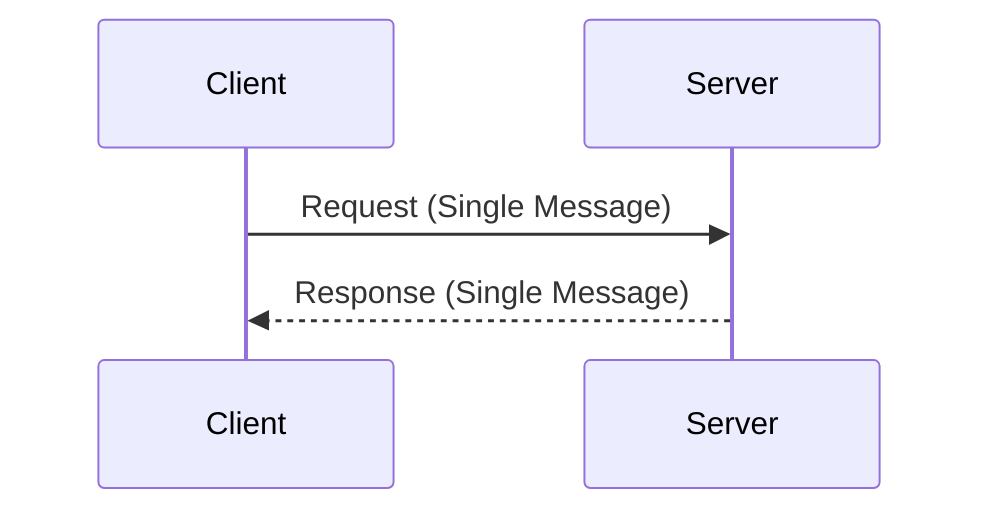
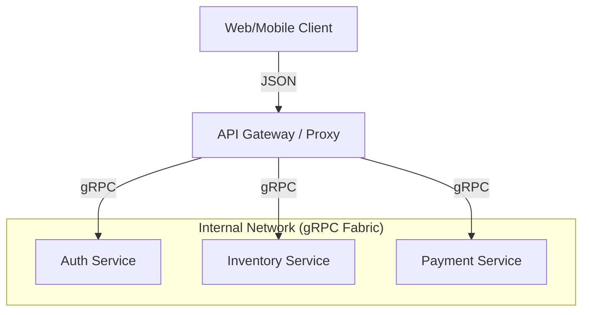

# System Design: The gRPC Masterclass (Speed, Scaling, and Safety)

When building complex full-stack systems, choosing the right communication protocol is critical for performance and scalability. This document provides an expert-level technical breakdown of gRPC's internal mechanics and how it compares to traditional architectural styles.

### 📋 Table of Contents
*   [The Origins of gRPC](#the-origins-of-grpc)
1.  [gRPC vs. REST (The Classic Duel)](#1-grpc-vs-rest-the-classic-duel)
2.  [gRPC vs. WebSockets (For Real-time)](#2-grpc-vs-websockets-for-real-time)
3.  [Engineering Deep Dive: The Mechanics of Speed](#3-engineering-deep-dive-the-mechanics-of-speed)
4.  [Advanced Protocol Internals (Expert Level)](#4-advanced-protocol-internals-expert-level)
5.  [Load Balancing: L4 vs. L7](#5-load-balancing-l4-vs-l7)
6.  [The Four Communication Patterns](#6-the-four-communication-patterns)
7.  [Recommended Architectural Pattern](#7-recommended-architectural-pattern)
8.  [The Engineering "Why": Motivation for Adoption](#8-the-engineering-why-motivation-for-adoption)
9.  [Real-world Cloud Infrastructure Integration](#9-real-world-cloud-infrastructure-integration)
10. [Industry Case Studies (At Scale)](#10-industry-case-studies-at-scale)
11. [Security: Zero-Trust in gRPC](#11-security-zero-trust-in-grpc)
12. [Technical Research & Benchmarks](#12-technical-research-benchmarks)
13. [Modern Tech Stack: Deploying for High Availability & Scale](#13-modern-tech-stack-deploying-for-high-availability-scale)
14. [The Engineering Paradox (When NOT to use gRPC)](#14-the-engineering-paradox-when-not-to-use-grpc)
15. [Conclusion: The "So What?" for Architects](#15-conclusion-the-so-what-for-architects)
16. [References & Further Reading](#16-references-further-reading)

---

## The Origins of gRPC
### A Planet-Scale Legacy

Before gRPC became the industry standard for microservices, it was a private, highly optimized tool inside Google’s private data centers known as **Stubby**. 

Understanding gRPC requires understanding the engineering crisis it was designed to solve: **The Communication Tax.**

### 1. The "Stubby" Internal Era (2001–2014)
In the early 2000s, Google’s infrastructure was growing at an exponential rate. Every user search triggered hundreds of internal calls between services (Search, Ads, Gmail, YouTube).
- **The Problem**: Using traditional textual protocols like JSON or XML meant that up to **30% of Google's CPU cycles** were being spent just on parsing text strings back and forth. 
- **The Solution**: Google Engineers (led by luminaries like **Jeff Dean** and **Sanjay Ghemawat**) developed a binary RPC system that replaced textual keys with numbered tags, drastically reducing payload size and compute cost.

### 2. 2008: Open-sourcing Protocol Buffers
Google realized that the "binary-first" approach was essential for the entire web. They open-sourced the serialization format (**Protocol Buffers**) to help developers define strict data contracts. However, the transport layer (Stubby) remained a proprietary secret for several more years.

### 3. 2015: The Birth of gRPC and HTTP/2
As the public web moved from HTTP/1.1 (where every request blocked the next) to **HTTP/2** (which allowed simultaneous multiplexed streams), Google saw the opportunity to release a second-generation RPC framework. 
- **The "g" Mystery**: Contrary to popular belief, the "g" in gRPC doesn't just stand for Google. In ogni release, the "g" changes meaning—e.g., gRPC version 1.1 was for "GORGEOUS", while 1.3 was for "GREAT".
- **The Result**: By building gRPC on top of HTTP/2, Google enabled the open-source community to build distributed systems that reached the same performance levels as their internal private cloud.

---

## 1. gRPC vs. REST (The Classic Duel)

| Feature | gRPC (Google RPC) | REST (Representational State Transfer) |
| :--- | :--- | :--- |
| **Protocol** | HTTP/2 | HTTP 1.1 or HTTP/2 |
| **Payload** | Binary (Protocol Buffers) | Textual (JSON/XML) |
| **API Contract** | Required (.proto file) | Optional (OpenAPI/Swagger) |
| **Streaming** | Native support (Bi-directional) | Request-Response only |
| **Browser Support** | Requires gRPC-Web proxy | Native |

---

## 3. Engineering Deep Dive: The Mechanics of Speed

### A. Protocol Buffers (Binary Serialization)
gRPC uses **Protocol Buffers** to eliminate the overhead of textual parsing.
- **Binary Format**: JSON objects can be up to 5x larger than the equivalent binary stream because JSON repeats field names (keys) in every message.
- **Field Numbering**: In `.proto` files, fields are identified by numbers (e.g., `string name = 1;`). Because only these numbers are sent over the wire, you can rename fields in your code without breaking the network contract.
- **CPU Efficiency**: Protobuf is designed for machine efficiency, drastically reducing the "serialization tax" on your servers.

### B. HTTP/2 Transport Features
- **Binary Framing**: Messages are broken into small, atomic frames for better management.
- **Multiplexing**: Sends multiple requests/responses over a *single* TCP connection simultaneously, solving the "Head-of-Line Blocking" problem.
- **HPACK Compression**: Maintains a dynamic table of headers to compress repetitive metadata across requests.

### C. Deadlines & Cancellations
gRPC provides first-class support for **Deadlines** (how long a client will wait) and **Cancellation Propagation**. If a client navigates away, the signal propagates through the entire microservice chain, instantly stopping work on the back-end to save resources.

---

## 4. Advanced Protocol Internals (Expert Level)

### A. Low-Level Serialization: Varints and TLV
To understand why Protobuf is so compact, we look at **Base 128 Varints**. 

> **Varint (Variable-length Integer)**: A method of serializing integers using one or more bytes. Smaller numbers use fewer bytes. This allows the number `1` to be stored as a single byte rather than a standard 4-byte (32-bit) integer, creating massive space savings in typical datasets.

In Protobuf, small integers are encoded using only as many bits as necessary, often fitting into a single byte. Combined with **Tag-Length-Value (TLV)** encoding, this removes the need for delimiters like commas or braces.

> **TLV (Tag-Length-Value)**: A binary data encoding scheme where 'Tag' identifies the field number, 'Length' specifies the data size, and 'Value' contains the actual data. This eliminates the need for expensive text-based keys (like `"user_id":`) found in JSON.

### A. Binary Framing
HTTP/1.1 sends data as plain text. HTTP/2 breaks it into atomic **Frames** (HEADERS, DATA, SETTINGS, PING).

> **Binary Framing**: The smallest unit of communication in HTTP/2. By breaking data into typed binary frames rather than textual lines, the protocol allows for much faster parsing and interleaved streams (multiplexing).

- **The "Trailer" Secret**: gRPC status codes (Success/Error) are sent in an HTTP/2 **Trailer Frame**. This allows the server to send the message body and *then* decide if the RPC succeeded or failed at the very last moment.

### C. Flow Control (Window Updates)
gRPC implements sophisticated flow control at the HTTP/2 layer. Using `WINDOW_UPDATE` frames, it ensures a fast sender cannot overwhelm a slow receiver's buffer, maintaining system stability during high-traffic bursts.

---

## 5. Load Balancing: L4 vs. L7

This is a critical production-grade consideration:
- **L4 (Transport Layer)**: Traditional load balancers see a single persistent TCP connection and pin it to one server, leading to unbalanced clusters.
- **L7 (Application Layer)**: Modern proxies (like Envoy) can see the individual *Requests* inside the multiplexed connection and distribute them evenly across the service fleet.

> **L7 Load Balancing**: Routing traffic at the "Application Layer" (OSI Layer 7). This allows the balancer to understand gRPC requests and distribute them across multiple servers even when they share a single TCP connection—a critical requirement for high availability.

---

## 6. The Four Communication Patterns

### 1. Unary (Simple Request-Response)
Classic one-to-one communication.

### 2. Streaming Patterns
| Pattern | Client Direction | Server Direction | Typical Use Case |
| :--- | :--- | :--- | :--- |
| **Server Stream** | Single Request | Continuous Stream | Live Stock/Sports Tickers |
| **Client Stream** | Continuous Stream | Single Response | Large File Uploads |
| **Bi-Di Stream** | Continuous Stream | Continuous Stream | Real-time Chat / Collaboration |

---

## 7. Recommended Architectural Pattern

For production-grade full-stack systems:
1.  **Edge Routing (Browser -> Gateway)**: REST or GraphQL (Compatibility).
2.  **Internal Fabric (Service -> Service)**: gRPC (High performance & Type safety).
3.  **Real-time Push**: WebSockets (Browser eventing).

---

## 8. The Engineering "Why": Motivation for Adoption

For a System Architect, the move to gRPC is driven by three primary non-functional requirements:

1.  **Direct Cost Savings (The Serialization Tax)**: In high-scale systems (millions of requests/sec), up to 30% of CPU cycles can be spent just on JSON parsing. By switching to binary Protobuf, you drastically reduce your compute bill and lower p99 latencies.
2.  **Polyglot Acceleration**: In a "Standardized Web" environment, your Go server can generate a Python client, a Java client, and a C++ client with a single command (`codegen.sh`). This eliminates the need for manual API client maintenance.
3.  **Contract-First Security**: Since the `.proto` file is the source of truth, there is zero ambiguity about payload types. This prevents entire classes of "Invalid Type" bugs that plague REST/JSON systems.

---

## 9. Real-world Cloud Infrastructure Integration

Deploying gRPC in the cloud requires specific architectural considerations for Load Balancing:

### A. AWS (Amazon Web Services)
- **Application Load Balancer (ALB)**: Now has native support for gRPC. You must use HTTPS (TLS) as gRPC requires the underlying HTTP/2 secure transport.
- **Network Load Balancer (NLB)**: Best for maximum throughput but operates at L4, meaning it cannot "see" individual requests within a multiplexed stream.

### B. Google Cloud (GCP)
- **Cloud Run**: Native gRPC support. Highly efficient for serverless microservices.
- **GKE (Google Kubernetes Engine)**: Often used with **Istio** or **Linkerd** (Service Meshes) to handle L7 load balancing and mutual TLS (mTLS) automatically between services.

### C. Azure
- **Azure Container Apps**: Native support for gRPC via Dapr or direct ingress.
- **Azure App Service**: Requires specific configuration to enable the HTTP/2 "Only" mode for gRPC listeners.

---

## 10. Industry Case Studies (At Scale)

- **Netflix**: Uses gRPC to manage their entire Studio workflow. The low latency of gRPC-streaming allows for real-time asset tracking in globally distributed teams.
- **Dropbox**: Replaced their legacy internal RPC with gRPC to handle trillions of file metadata operations. They cited a 40% reduction in CPU overhead after the migration.
- **Google**: Every internal service at Google communicates via gRPC (evolved from their internal 'Stubby' protocol). It is the backbone of Search, Gmail, and YouTube.

---

## 11. Security: Zero-Trust in gRPC

In a modern cloud environment, we often implement **Mutual TLS (mTLS)**.

> **Mutual TLS (mTLS)**: A security protocol where both the client and server verify each other's digital certificates before establishing a connection. Unlike standard HTTPS (where only the server is verified), mTLS ensures that only authorized microservices can talk to each other.

- **Handshake**: Both the Client and Server prove their identity using certificates.
- **Traffic**: All gRPC binary streams are encrypted, ensuring that even if the internal network is breached, the data remains unreadable.

---

## 12. Technical Research & Benchmarks

Research indicates that the shift to gRPC is not just theoretical:
- **Throughput Advantage**: For large payloads (>100KB), gRPC can offer up to **10x higher throughput** due to binary framing and header compression.
- **Mobile Battery Efficiency**: Binary parsing is 3-5x more efficient than JSON parsing on mobile CPUs, leading to measurable improvements in device battery life for intensive apps.
- **Interoperability**: Research into "Polyglot Systems" shows that gRPC reduces the time-to-market for new microservices by **30-40%**, thanks to unified interface definitions.

---

## 13. Modern Tech Stack: Deploying for High Availability & Scale

When moving from this lab to a production environment, the focus shifts to **High Availability (HA)**, **Scalability**, and **Ultra-Low Latency.**

### A. Container Orchestration (Kubernetes)
In a modern stack, gRPC services are deployed as containers within a cluster (GKE, EKS, or AKS).
- **Horizontal Pod Autoscaling (HPA)**: We scale the number of pods based on custom metrics like "Concurrent gRPC Streams" or CPU utilization.
- **Zonal/Regional Distribution**: To ensure **HA**, pods should be distributed across multiple Availability Zones. If one zone fails, the gRPC traffic is automatically rerouted to the healthy pods in other zones.

### B. Service Mesh (The L7 Control Plane)
gRPC’s long-lived connections make traditional load balancers problematic. We use a **Service Mesh** (like **Istio** or **Linkerd**) to handle:

> **Service Mesh**: A dedicated infrastructure layer that controls service-to-service communication. It uses a "Sidecar Proxy" sitting next to your application to handle networking, security, and observability automatically, without you having to write that code in your app.

- **L7 Load Balancing**: Distributing individual RPC calls across all available pods, even within a single TCP connection.
- **mTLS by Default**: The mesh automatically handles certificate rotation and encrypted traffic between microservices.
- **Circuit Breaking**: If a specific service instance starts failing, the mesh "trips the circuit," preventing it from receiving more traffic and protecting the rest of the system.

### C. Observability at Scale
gRPC's binary nature requires specialized monitoring. A modern tech stack includes:
- **OpenTelemetry**: For distributed tracing, allowing you to follow a single request across 20+ microservices.
- **Prometheus & Grafana**: Monitoring gRPC-specific Golden Signals:
    1. **Latency**: p99 response time per method.
    2. **Traffic**: Requests per second (RPS).
    3. **Errors**: gRPC status codes (found in Trailers).

### D. Global Scalability
For global platforms, we use **Global Server Load Balancing (GSLB)**. 
- A user in Tokyo connects to a gRPC cluster in `asia-northeast1`, while a user in London hits `europe-west2`. This minimizes the physical distance data must travel, keeping the "Speed of Light" latency as low as possible.

---

## 14. The Engineering Paradox (When NOT to use gRPC)

An expert architect knows that **gRPC is not a silver bullet.** There are several high-value scenarios where the protocol introduces more friction than performance gain.

### A. Agentic Engineering & LLM APIs (The Unstructured Text Paradox)
While gRPC is blisteringly fast for structured data (small integers, enums, repetitive fields), it offers almost zero benefit for the large, unstructured payloads found in **Agentic Engineering** (LLM outputs).
- **The Payload Problem**: When an LLM returns 4,000 tokens of raw Markdown text, the "serialization tax" of JSON is negligible compared to the size of the data itself. Compressing a JSON string containing raw text is nearly as efficient as binary Protobuf because the field keys occupy less than 1% of the total payload.
- **Native Browser Streaming**: Agentic interfaces are heavily web-based. Standard browsers lack the low-level HTTP/2 frame control (specifically **Trailers**) required for native gRPC. While `gRPC-Web` exists, it requires an Envoy proxy to bridge the connection. 
- **The SSE Alternative**: LLM providers like OpenAI use **Server-Sent Events (SSE)** because they are natively supported by every browser, require no proxy, and handle "Time-to-First-Token" streaming with much less implementation complexity than gRPC.

### B. Serverless & Edge (Statelessness vs. Persistent TCP)
gRPC is built for high-performance, long-lived, multiplexed TCP connections where a single pipe is kept open for thousands of requests. This is the architectural opposite of the **Serverless/Lambda** model.
- **The Connection Overhead**: Serverless functions are short-lived and "stateless." Forced to establish a new mutual-TLS handshake and gRPC connection for every single request, the "Startup Tax" on a Lambda often negates any performance gain seen in the binary encoding.
- **Sticky Sessions**: In environments like **AWS Lambda** or **Vercel Functions**, gRPC's persistence model can lead to poor load balancing, as the function instances die before the protocol's connection reuse benefits can be realized.

### C. Public "Open" APIs and The "Codegen Debt"
Forcing third-party developers to adopt gRPC for a public-facing API is often a massive strategic error due to the **Barrier to Entry.**
- **Instant Accessibility**: A REST/JSON/OpenAPI endpoint can be tested instantly with `curl`, `Postman`, or a simple browser fetch. 
- **The Friction of Protobuf**: gRPC requires the developer to download a `.proto` file, install specialized tooling, and generate language-specific code (`codegen.sh`) before a single request can be made. For "Self-Service" public APIs, this friction often drives developers to competitors who offer a simple JSON endpoint.

### D. Simple CRUD & Slow-Motion "Monolithic-Microservices"
If you are building an application with only two or three internal services that share low-frequency traffic, the "Codegen Debt"—the overhead of maintaining identical `.proto` files across three different repositories—is frequently higher than the latency savings.
- **Human Complexity**: The complexity of managing Protobuf versioning and breaking-changes (Backward/Forward Compatibility) is an engineering cost. Use gRPC only when the **frequency of communication** between services (millions of requests/sec) justifies the added operational guardrails.

### E. Large Scale Media (The Video/Binary Problem)
While gRPC has a `stream` keyword, it is often not the best choice for streaming massive binary files (like 4K video or multi-gigabyte datasets).
- **Chunk Management**: gRPC breaks streams into message-sized chunks with significant metadata overhead per chunk.
- **The HTTP Standard**: Traditional **HTTP Range-Requests** are much better optimized at the infrastructure layer (CDNs, Edge Caches) for delivering massive binary data without the overhead of the gRPC application layer.

---

## 15. Conclusion: The "So What?" for Architects

The core value of gRPC isn't just "faster JSON." It is a fundamental shift in how we build distributed systems.

- **Developer Productivity**: Instead of writing manual API clients for 5 different languages, you write one `.proto` file and let the machine handle the rest.
- **Microservice Reliability**: With native support for Deadlines and Cancellations, your systems become self-healing, preventing the "Cascading Failures" that often take down large-scale REST architectures.
- **Future-Proofing**: As the web moves toward **Binary-First** and **Stream-First** models (like WebRTC or HTTP/3), gRPC prepares your architecture for the next decade of performance requirements.

---

## 16. References & Further Reading

For those who want to dive deeper into the protocol's foundations:

1.  **HTTP/2 Specification (RFC 7540)**: [https://httpwg.org/specs/rfc7540.html](https://httpwg.org/specs/rfc7540.html)
2.  **Official gRPC Documentation**: [https://grpc.io/docs/](https://grpc.io/docs/)
3.  **Protocol Buffers Language Guide**: [https://protobuf.dev/programming-guides/](https://protobuf.dev/programming-guides/)
4.  **Netflix Engineering Blog: gRPC at Scale**: [https://netflixtechblog.com/](https://netflixtechblog.com/search?q=grpc)
5.  **Dropbox Tech Blog: The Migration to gRPC**: [https://dropbox.tech/](https://dropbox.tech/infrastructure/courier-dropbox-grpc-sidecar)
6.  **Uber Engineering: Why We Use gRPC**: [https://eng.uber.com/](https://eng.uber.com/search?q=grpc)
7.  **Google Developers: The History of Protocol Buffers**: [https://protobuf.dev/overview/](https://protobuf.dev/overview/)

### Next Steps for Learners:
- Explore the [README.md](./README.md) to start the hands-on lab.
- View the [Interface definition](./protos/messenger.proto) to see a production-grade schema in action.
