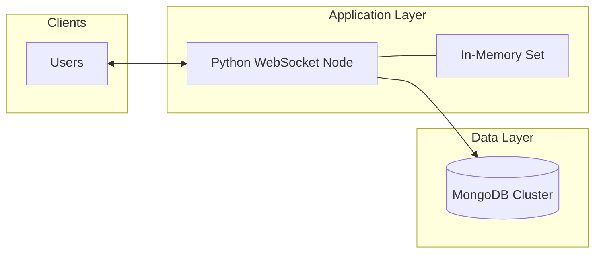
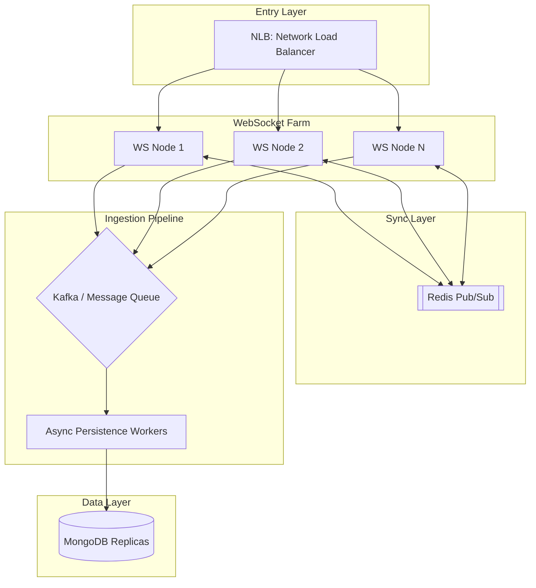

# Deep Dive: High-Scale Real-time Music Activity System

This document outlines the architectural evolution from a single-node prototype to a globally distributed, high-availability system capable of handling millions of concurrent users.

---

## Step 1: Scope of the Problem

### Functional Requirements
*   **Real-time Interaction**: Users can "Like" a track; all other listeners of that track receive a notification in <200ms.
*   **Persistence**: Every "Like" must be durably stored for analytics and historical counts.
*   **Global Totals**: Every broadcast must include the up-to-date total like count for that track.

### Non-Functional Requirements
*   **High Concurrency**: Support for 1M+ concurrent WebSocket connections.
*   **Low Latency**: Near-instant feedback loop for social engagement.
*   **Availability**: The system must remain functional even if individual nodes fail.
*   **Eventual Consistency**: It is acceptable if a "Like" count is briefly off by a second, but it must eventually converge.

---

## Step 2: Assumptions & Constraints
*   **DAU**: 10 Million Daily Active Users.
*   **Peak Concurrency**: 1 Million simultaneous users.
*   **Write Throughput**: Avg 1,000 likes/sec; Peak 5,000/sec (during a major album release).
*   **Data Size**: ~400 bytes per event. Monthly data growth: ~2.5 TB.
*   **Bandwidth**: 1M users x 1KB heartbeat/status per minute = ~16GB/min just for maintenance.

---

## Step 3: Initial Component Design (MVP)

**Flow**:
1. Client sends "Like" via WSS.
2. Node inserts into MongoDB.
3. Node increments local count or queries MDB.
4. Node iterates through `REG` and sends `socket.send()`.

---

## Step 4: Identifying Key Issues (Bottlenecks)
1.  **Vertical Scaling Limit**: A single Python node (even with `asyncio`) is limited by RAM (storing connection objects) and the OS file descriptor limit (~65k). It cannot handle 1M users.
2.  **Broadcast Isolation**: If User A is on `Node 1` and User B is on `Node 2`, User B will *never* see User A's likes because `Node 2`'s memory registry is empty of Node 1's clients.
3.  **Database Bottleneck**: Directing 5k writes/sec + 5k reads/sec to a single MongoDB collection during peaks can cause "Head-of-Line" blocking.
4.  **Zombie Connections**: If a client's internet flickers, the server might keep the socket open (wasting resources) until a TCP timeout occurs.

---

## Step 5: Redesign for High Scale & Reliability

### Strategic Improvements:
1.  **Horizontal Scaling (The WebSocket Farm)**: We use an L4 Load Balancer (like AWS NLB) to distribute 1M connections across 20-50 nodes.
2.  **Global Synchronization (Redis Pub/Sub)**:
    *   When `Node 1` receives a Like, it publishes an message to a Redis channel: `PUBLISH song_123_updates '{"count": 45}'`.
    *   All other Nodes (2..N) are subscribed to this channel and immediately push the update to *their* local clients.
3.  **Decoupling Writes (Kafka)**: instead of the WS Node waiting for MongoDB to finish the write (which adds latency), the Node drops the event into **Kafka**. Persistence Workers then batch-write to MongoDB.
4.  **Health Checks & Pings**: Implement a "Heartbeat" mechanism where the client sends a `PING` every 30s. If the server doesn't receive it, it clears the registry immediately.

---

## Step 6: Wrap Up & Trade-offs
*   **Latency vs. Durability**: By using Kafka, we prioritize the "Broadcast" (Low Latency) over the "Save" (Durability). If the DB is down, the live notifications still work!
*   **Redis as a SPOF**: Redis becomes critical. We must use **Redis Sentinel** or **Redis Cluster** to ensure it doesn't become a single point of failure.
*   **Monitoring**: We need ELK Stack for logging and Prometheus/Grafana to monitor "Active Connections" and "Broadcast Lag."

**Final Verdict**: This architecture handles the "Thundering Herd" problem (major album releases) by decoupling the user's "Ping" from the expensive database "Write."
